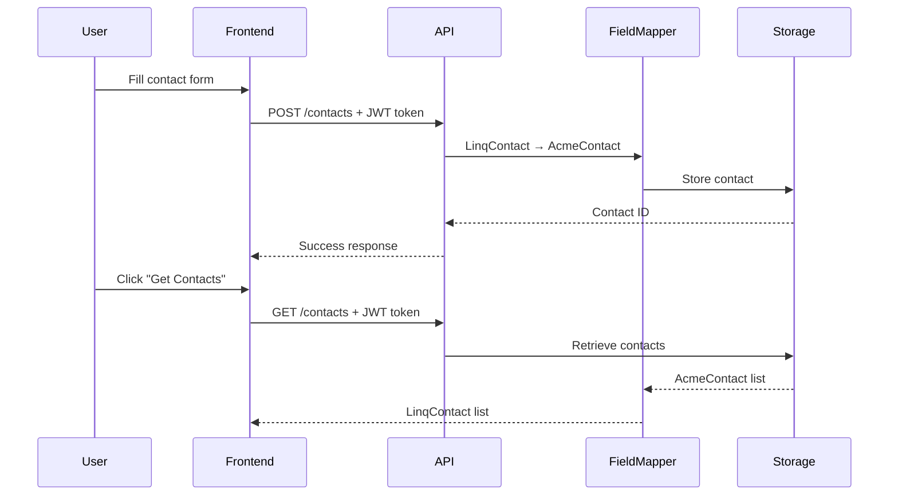

# Linq-AcmeCRM Integration API

FastAPI service demonstrating Linq's CRM integration capabilities.

##  Quick Start

### Option 1: Docker (Recommended)
```bash
# Build and run with Docker Compose
docker-compose up --build

# Or with Docker directly
docker build -t linq-crm-integration .
docker run -p 8200:8200 linq-crm-integration
```

### Option 2: Local Development
```bash
# Start backend
uvicorn main:app --reload --port 8200

# Open frontend
start_frontend.bat
```

### Option 3: One-Click Frontend
```bash
start_frontend.bat
```

##  API Endpoints

| Endpoint | Method | Description |
|----------|--------|-------------|
| `/contacts` | POST | Create contact from Linq format |
| `/contacts` | GET | Get all contacts in Linq format |
| `/contacts/stats` | GET | Contact statistics |
| `/health` | GET | Health check |

##  Authentication
Use these mock JWT tokens:
- `linq-demo-token`
- `linq-assessment-token`
- `linq-sales-engineer`

##  Structure
- `main.py` - FastAPI app (port 8200)
- `frontend/` - HTML demo (port 8080)
- `models/` - Pydantic models
- `services/` - Business logic
- `tests/` - Unit tests

##  Features
✅ FastAPI backend  
✅ JWT authentication  
✅ Field mapping  
✅ In-memory storage  
✅ Frontend demo  
✅ Swagger docs  
✅ Environment variables  
✅ Port 8200/8080  
✅ Docker containerization


##  Data Flow


